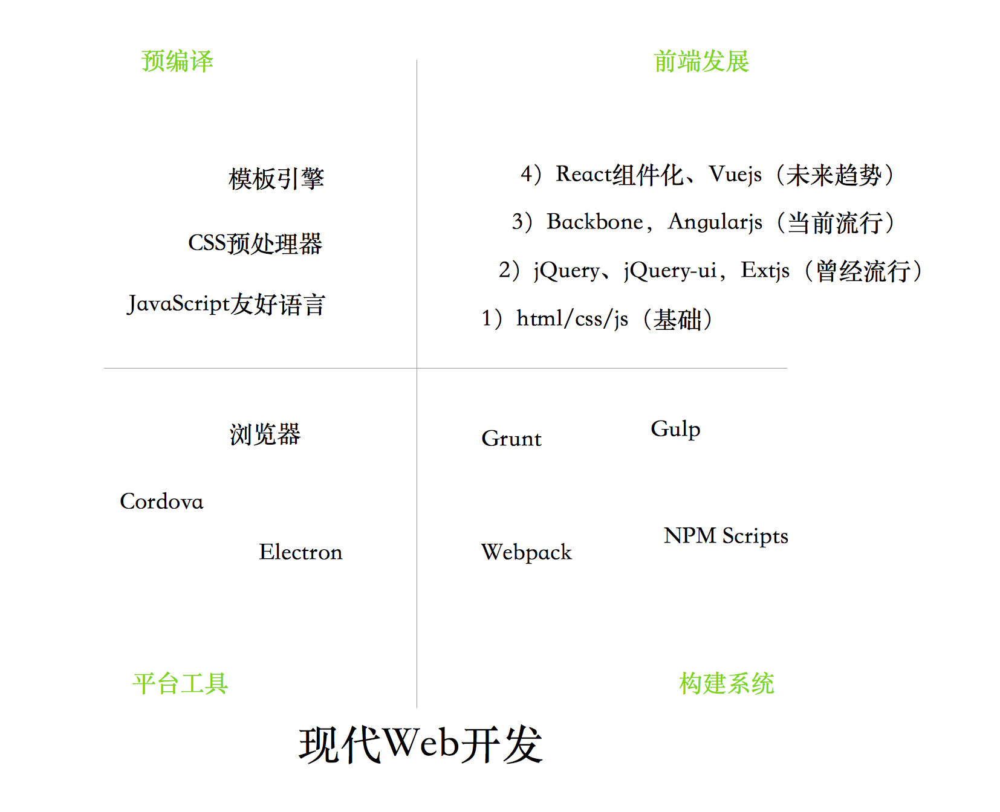
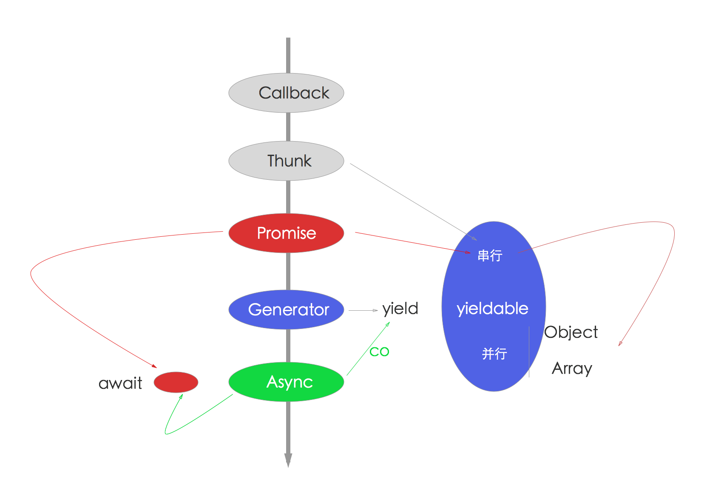
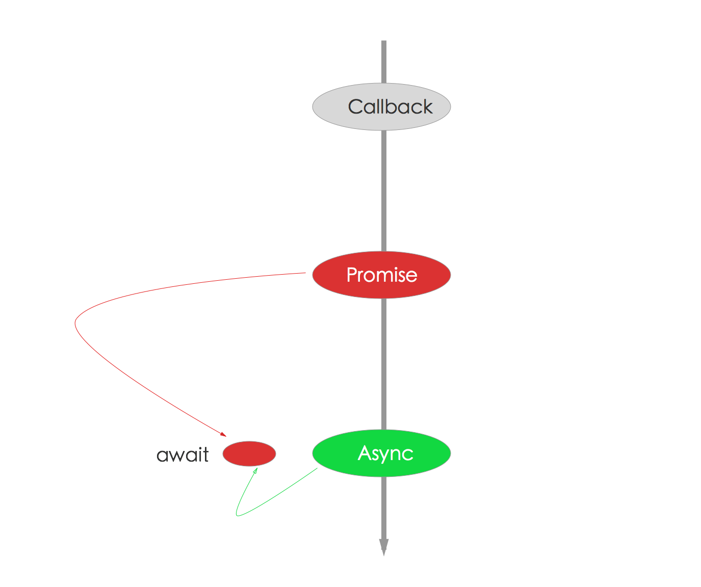
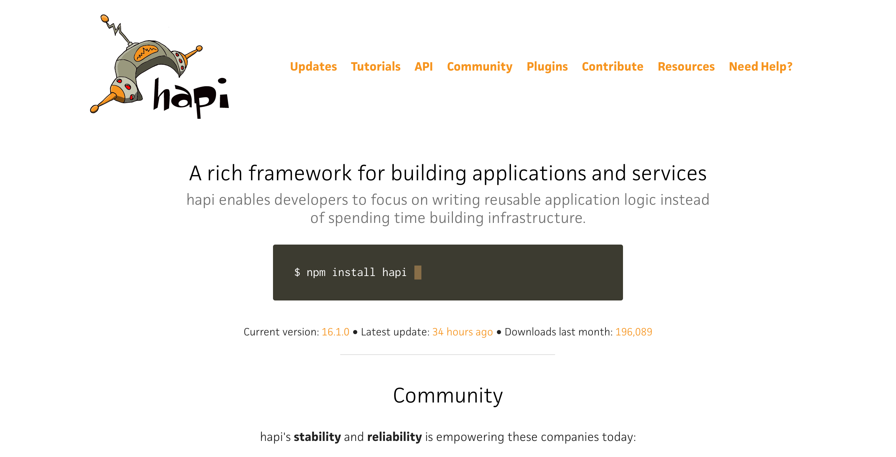
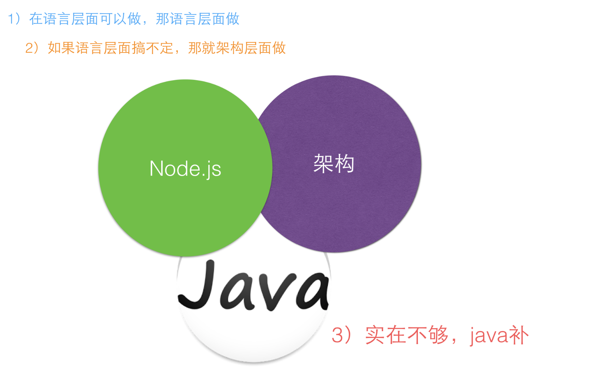

# 你们是不是想看框架大战？

Node.js从2009横空出世之后，至今已经7年有余，各种web框架也林林总总，目前大约在npm上有35万左右包，刨去前端和一些无意义的封装，也是有非常可观的优秀的模块的。其中web框架也是特别抢眼的，从早期的express到现在koa，对异步流程控制的改进前仆后继。随着移动端崛起面向api的框架hapi和restify也如火如荼，更有一些面向特性的框架，比如thinkjs对es6/es7/typescript支持，整体来说，质量都是非常不错的，算百花齐放，还是那句话，即使不优化，你也能用这些框架获得较高的性能。

本文先概述Node.js的应用场景，各种框架比较（express、koa、thinkjs、hapi、restify、meteor、sails、egg等），最后给出技术选型和框架选型技巧。

## Node.js的应用场景

这是现代web里Node.js参与的部分。其实Node.js的应用场景，远远不止这些，目前都用的比较浅，大部分围绕在前端和Proxy层，这其实是不够的，但由于历史原因，很多遗留问题，目前Node.js只能先搞定前端，然后做Proxy层，然后继续在Proxy组装rpc服务，让Java等专注提供服务就好，这是一个理想的边界，对Node.js和Java来说是双赢的，将服务组装和api交给Node.js能够更灵活、应变，当线上系统遇到崩溃的时候，前端直接改就好了，同时又不影响Java优点的使用。

Node.js能干什么？

- 网站（如express/koa等）
- im即时聊天(socket.io)
- api（移动端，pc，h5）
- http proxy（淘宝首页）
- http proxy延伸，组装rpc服务，作为微服务的一部分
- 前端构建工具(grunt/gulp/bower/webpack/fis3...)
- 写操作系统（NodeOS）
- 跨平台打包工具（nw.js、electron、cordova/phonegap）
- 命令行工具（比如cordova）
- 编辑器（atom，vscode）

更多的见
https://github.com/sindresorhus/awesome-nodejs 和 http://stackshare.io/nodejs/in-stacks

## 异步流程演进

这里加异步流程演进部分，目的是为了后面讲述框架变化做铺垫，同时异步流程控制也是Node.js非常核心的内容，是每个开发者都必须掌握的。

JavaScript流程控制的演进过程，分以下6部分:

1. 同步代码
2. 异步JavaScript: callback hell
3. Thunk
4. Promise/a+
5. 生成器Generators/yield
6. Async函数/Await（以前说是ES7 stage-3）

看起来挺简单的，作为*js（沾边）工程师的各位自测一下，当前是哪个阶段？

我对异步流程控制的总结

- Async函数是趋势，如果Chrome 52. v8 5.1已经支持Async函数(https://github.com/nodejs/CTC/issues/7)了，Node.js已经支持，Node.js 7.x版本需要加flag才能开启，在明年的8.x里会默认开启。
- Async和Generator函数里都支持promise，所以promise是必须会的。
- Generator和yield异常强大，不过不会成为主流，所以学会基本用法和promise就好了，没必要所有的都必须会。
- co作为Generator执行器是不错的，它更好的是当做Promise 包装器，通过Generator支持yieldable，最后返回Promise，是不是有点无耻？

我整理了一张图，更直观一些。

- 红色代表Promise，是使用最多的，无论async还是generator都可用
- 蓝色是Generator，过度货
- 绿色是Async函数，趋势

**结论**：Promise是必须会的，那你为什么不顺势而为呢？

**推荐**：使用Async函数 + Promise组合，如下图所示。

## Web框架大战

### Express or Koa?

Express是Node.js世界里最著名的框架，非常成熟、稳定，目前也是大家用的最多的框架。

先看一下演进的历史，最早是有connect，一个中间件框架，是对Node.js内置的http模块的补充，主要是提供了中间件机制。然后有了express，在express 4.0之前都是内置connect作为中间件内核的，在4.0之后就剔除了connect，express自己实现中间件机制，但兼容connect系列的中间件，所以很多书（比如Node.js in action）介绍http之后介绍connect之后介绍express，虽然Node.js版本老点，当整体来看，说不过时的。在express下一个版本里router也会被独立出去，但2年了，迟迟未发，中间颇为周折，最开始是tj名下的，后来tj象征性的转让给strongloop，但是转过去之后并不是很愉快，导致很多人呼吁独立，毕竟商业公司和开源不一样，所以就转到express org下面，独立了，由dougwilson一直维护。express的代码和测试都非常不错，大家可以看看，尤其是测试，会扒出无数没有遇到的场景，是学习的非常的途径。

说完了express再说说Koa，koa 仍然是由 Express 原班人马打造的，致力于成为一个更小、更富有表现力、更健壮的 Web 框架。一个追求极致的框架，代码大约只有550行。对express基本上是0兼容，无论是中间件，还是用法、异常处理等，标新立异的让了解express的人咋舌，但破旧才能立新，也未尝是坏事。Koa最初是利用generator来实现异步控制，让代码在generator里看起来像同步调用，这其实是tj对generator的hack用法，后来还衍生出了co这个很有名的库，koa 1.x就是基于co + generator作为核心的。用了generator就会有一个问题，generator里只能使用this来处理上下文，所以this肆虐，到处都是。另外一个问题就是有generator+co导致koa的中间件和express中间件完全不一样，应该这样说，是强大了很多。这就是koa经典的洋葱模型-中间件机制，和Django Middleware非常像

它可以出来请求之前和请求穿过中间件后回来的请求，这样的便利非常大，代码精简，异常等都能有更好的处理。

但this的问题还是很头疼，而且还要支持async/await，于是就有koa 2.x，为了把koa的中间件改写，koa团队改变了co为promise-based模式，继而提供co.wrap处理generator，同时又提供了compose将中间件转成`(ctx,next) => {}`形式，这样就完成Koa 2.x的中间件3种调用方式的定型，使得Koa支持promise\generator\async等异步流程处理方式，变得更加fashion和通用，也就慢慢的开始流行了。对于Koa 1.x的中间件，Koa 2.x也是要向后兼容的，于是有了convert这个库。

整体来说，Koa团队做的还是非常不错的，不过限于定位和时间，不太合适和express做对比。下面看一下[比较](https://github.com/koajs/koa/blob/master/docs/koa-vs-express.md)

| Feature           | Koa | Express | Connect |
|------------------:|-----|---------|---------|
| Middleware Kernel | ✓   | ✓       | ✓       |
| Routing           |     | ✓       |         |
| Templating        |     | ✓       |         |
| Sending Files     |     | ✓       |         |
| JSONP             |     | ✓       |         |

拿koa来比较express并不太合适，可以说它是介于connect和express中间的框架

- 与connect类似都是调用栈思想，但修改了中间件模式，Koa 1.x使用generator，Koa 2.x中间件更丰富
- 把express里的一些好的东西加进去，但剔除了路由，视图渲染等特性
- 对异常处理更好

给出定位

- Express成熟稳定，入门、应用俱佳
- Koa是下一代web框架，大势所趋

我个人特别喜欢Koa 2.x，上面的异步流程控制里也说过，Promise是必须会的，而且未来的趋势async/await，而await后面可以直接接Promise，所以Koa 2.x真的是大势所趋。

目前论成熟度Koa比express差点，学习曲线Koa比express要高些，对于喜欢动手的朋友还是非常好的。我相信在2017年会有更多基于Koa 2.x的知名框架的。

### 面向特性的Thinkjs

Thinkjs 是一个快速、简单的基于MVC和面向对象的轻量级Node.js开发框架，遵循MIT协议发布。秉承简洁易用的设计原则，在保持出色的性能和至简的代码同时，注重开发体验和易用性，为WEB应用开发提供强有力的支持。

Thinkjs里面很多特性来源于ThinkPHP，同时根据Node.js的特点，使用了Promise, WebSocket等特性，让代码更简洁、优雅。

Thinkjs最大的特色是对目前比较潮的语法特性支持的特别好，比如es6、es7、typescript等，有了这些，对aysnc/await等特性支持，让代码更加fashion

Thinkjs的特点

- 完全自己实现，对已有框架很少借鉴
- 内置各种adapter，db，中间件，hook，插件，非常丰富，all in one 比组装更适合新手
- 遵循mvc和coc
- 使用最潮的es6/es7/ts特性，对aysnc函数，exports等都非常好的支持
- 支持i18n等实用功能
- 内置pm2和nginx集成，部署方便
- 有自己的脚手架，稍弱
- 性能不错，虽然比express稍弱，但功能强大许多
- 测试丰富，代码质量有保障
- 文档健全，是经过设计的，支持多语言
- 背后有75团和李成银支持，最近一周内有更新，代码提交2600+，35人贡献，整体来说算健康

不足也是有的

- 参考Thinkphp，对于熟悉rails类的人不太舒服，熟悉php的人应该上手极其简单
- babel安装包还是比较大啊，虽然很多人已经标配
- 代码完全自己实现，难免有些命名，习惯上的问题
- 很难复用开发者已有的经验，跟express、koa几乎是另外一条路

> 结语：在目前来看，对于最潮的es6/es7/ts特性上，Thinkjs几乎是唯一的选型。如果用户是新手或者对新特性熟悉或者有php开发经验，将会是一款快速开发的利器。

### 面向api的Hapi

你可能不知道hapi，我猜你可能用过joi这个模块，它们都是[沃尔玛团队](http://www.walmartlabs.com/innovation/open-source/)开发的，joi是很好用的验证模块，我们有理由相信这个团队的核心项目hapi也是不错的。

2011年8月5日，WalmartLabs的一位成员Eran Hammer提交了Hapi的第一次commit。Hapi原本是Postmile的一部分，并且最开始是基于Express构建的。后来它发展成自己自己的框架，正如Eran在他的博客里面所说的：

> Hapi基于这么一个想法：配置优于编码，业务逻辑必须和传输层进行分离..

Hapi最新版本为16.1.0（版本帝，而且尤其喜欢升大版本），拥有4879次commits，并且仍然由Eran Hammer维护。

Hapi的发音是happy，一般我都读成h-api

一句话

> Web and services application framework

（web和服务）应用框架，开篇名义，非常好理解，对于web和service开发都是非常好的框架。一般我们见到的到多是web框架，很少有强调服务的，hapi里的api大概就是起名之初就确定了它的定位。一直以来我都喜欢把hapi和restify放到一起，从名字和框架功能上看，他们对于api服务的支持要好于哪些所谓的web框架。

再看一下更详细的定义

> hapi is a simple to use configuration-centric framework with built-in support for input validation, caching, authentication, and other essential facilities for building web and services applications. hapi enables developers to focus on writing reusable application logic in a highly modular and prescriptive approach.

- configuration-centric是以配置为中心
- 内置用于构建web和service应用的：验证, 缓存, 鉴权, 和其他基础设施
- hapi让开发者更加专注编写可重用的应用逻辑

优点

- 高性能 - WalmartLabs的那些人开发Hapi的时候，遵守Benchmark Driven Development，其结果hapi是一个high-performance的框架
- 安全 - Eran Hammer（Hapi开发者组长）是OAuth (安全授权) 规范的最初作者。 他有关注hapi安全的意识，并review所有Hapi包含的代码。很多[Node Security 项目](https://nodesecurity.io/)的成员是是Hapi的核心贡献者，这意味着非常多关注安全的眼睛在关注代码安全
- 可扩展性 - 应对高并发还是非常好的
- Mobile 优化 (轻量级 - 为移动电商而构建)
- 插件架构 - 扩展/增加 你自己的模块 (良好的生态)
- 对 DevOps 友好 - 基于配置的开发和强大的stats/logging
- 内置缓存 (Redis, MongoDB 或 Memcached) 
- 核心代码做了100% 测试/代码覆盖率 - 严格的方法来保证质量
- 可测试性 - hapi内置端到端测试，因为它包含了[shot](https://github.com/hapijs/shot)模块
- 核心功能内置，而其他特性以插件的形式展现: http://hapijs.com/plugins

总结hapi好的点

- 定位非常准，以api作为切入点，区别express等传统web框架
- 背后有沃尔玛公司应用、支持，项目也还是比较健康的，是经过大规模应用的
- 基本可以做到开箱即用，和thinkjs差不多，但比thinkjs的插件要丰富很多
- 文档还算可以
- 辅助性的工具还是非常完善的，尤其是devops相关的，比express等要好很多

不好的点

- 框架的api和代码具有沃尔玛风格，不是很规范
- 对于新特性没有内置，也还是算比较传统

hapi里处处是配置，处处插件化，毁誉参半吧，对它的view部分设计不是很喜欢，有兴趣的可以以测测性能，应该不会比express好。

> 如果说作为api类的服务，hapi是一个不错的选择

## 如何做框架选型？

很多人都争论这个问题，不同的leader也有不同的解决方案，那么，如何做框架选型呢？我总结了一下，大概有3个决定因素

- 场景，是做api还是管理后台，还是h5，不同的应用场景会有不一样的选择
- 团队能力，如果团队Node.js经验非常丰富就无所谓，如果不是特别熟，那就至少要有一个人能cover住，如果都没有，那就挑选最成熟的最保守的做吧
- 趋势，如果leader大局观不错，综合上面2点，再辅以趋势的话，就非常好，毕竟现在技术革新太快，别你刚学会，别人都不用了，也是比较痛苦的。

无论如何，至少要有一个人能cover住，这是我选型的根本，框架再好，也不是给你设计的，所以难免会各有各种各样的问题，那么你就只有一个选择了

> f**k = fork or fuck

## 如何做技术选型？

先说技术选型的3个思考点

- 在语言层面可以做，那语言层面做
- 如果语言层面搞不定，那就架构层面做
- 如果架构层面也搞不定，这东西就不能用了

各自做各自合适的事儿就好，下面分别举例看看

我们很坦然的面对Node.js的优点和缺点

- 1）语言层面能解决的
  - 已有大量npm上的模块(目前在35万个以上) 
  - 自己造轮子(站在海量包上+简单语法+npm=快速)
  - 使用Node.js里的[nan](https://github.com/nodejs/nan)自己包装c/c++轮子

绝大部分需求都可以满足了  

- 2）架构层面能解决的
  - 业务边界、模块拆分、面向服务
  - mq、rpc、cache
  - 运维、监控、自动化

稍微解释一下

- 首先，架构和是不是Node.js写的没关系，是独立的
- 其次，架构师常用的东东有足够的Node.js模块支持，比如mq，像rabbitmq有比较好的node模块支持，像rpc里thrift、grpc、tchannel支持的都不错，我们使用的senecajs，比如redis，我们使用的ioredis，后面做ha都是一样的。
- 合适的场景用合适的东西

有很多东西是Node.js不擅长，又不在架构范畴里的，咋办？

3）如实在不够，java补（严格点，应该叫其他语言补）
  - 比如复杂excel生成
  - 比如apns推送（go做其实也很好，不过除了我，没人能维护。。。）

但凡是java或其他语言里比较成熟的库，可以作为独立服务使用的，都可以做Node.js的支持。避免过多的时间用在早轮子上，影响开发进度

> 在架构层面上，取长补短，才是最重要的。

## 写在最后

在2017年，Node.js会往后端继续前进，如果能够把rpc服务组装部分做好，我觉得就非常好了。随着React、Vue、Typescript、Flow、Lerna、Webpack、Vscode等带动，Node.js一定会取得更辉煌的成绩！

限于篇幅和读者的习惯，关于restify，同构的meteor，蚂蚁金服刚开源的eggjs或者其他框架，欢迎参加知乎live，点击阅读原文，即可与狼叔一起讨论，不只是学习，更是与大牛近距离接触，StuQ你值得拥有

